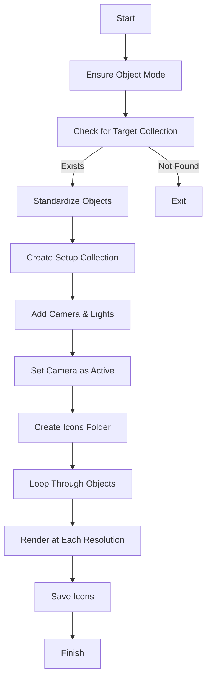

# Blender Batch Renderer

This script automates the process of standardizing, scaling, and rendering objects in Blender. It ensures objects fit within the camera view, applies a 3-point lighting setup, and generates renders at multiple resolutions (1024px, 512px, 256px, 128px and 64px).

## Usage

1. Place your objects in a collection named **"Target"**.
2. Run the script in Blender's scripting editor.
3. The script will:
   - Standardize object transformations
   - Set up a camera and lighting
   - Render each object at multiple resolutions
   - Save renders in the `Icons` folder

## Script Flow

