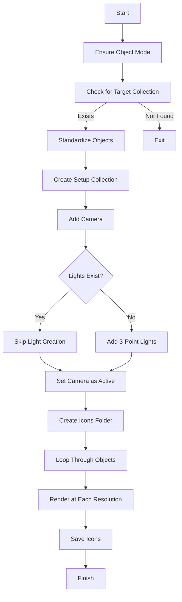

# Blender Batch Renderer

This script automates the process of standardizing, scaling, and rendering objects in Blender with videogame icon generation in mind. It ensures objects fit within the camera view, applies a 3-point lighting setup (if no lights exist), and generates renders at multiple resolutions (1024px, 512px, 256px, 128px and 64px).

## Usage

1. Place your objects in a collection named **"Target"**.
3. Run the script in Blender's scripting editor.
4. The script will:
   - Standardize object transformations
   - Set up a camera
   - Automatically add 3-point lighting **only if no lights exist** (if you add your own lights, the script will respect them)
   - Render each object at multiple resolutions
   - Save renders in the `Icons` folder

## Script Flow

